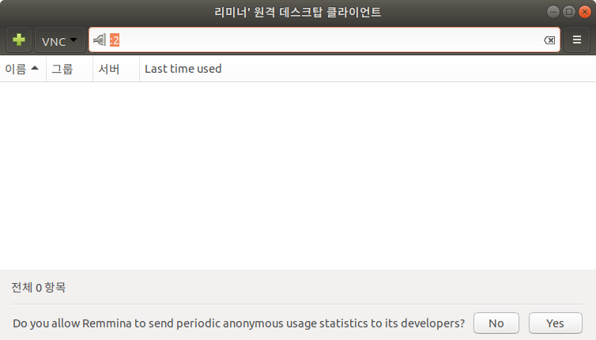

# Open Channel SSD를 위한 QEMU-NVME의 설치

이 글은 Ubuntu 18.04에서 진행된 내용이므로 다른 곳에서의 올바른 동작을 보장하지 않는다는 점을 유념해주시길 바랍니다. 그리고 모든 내용은 [출처](https://github.com/OpenChannelSSD/qemu-nvme)를 바탕으로 하여 만들어졌습니다.

## 컴파일과 인스톨 과정

먼저 설치를 하기 위해서 디렉토리를 `cd ~`로 이동해주도록 합니다. 그런 다음에 아래와 같이 작성해주시길 바랍니다.

```bash
git clone https://github.com/OpenChannelSSD/qemu-nvme.git
```

약간의 시간이 걸려서 다운을 다 받으면 다음 작업을 수행해주시길 바랍니다.

```bash
cd qemu-nvme
./configure --target-list=x86_64-softmmu --prefix=$HOME/qemu-nvme
```

이 경우에 각종 패키지가 없으니 설치해달라고 뜰 수 있습니다. 따라서 이를 설치하기 위해서 아래의 명령을 쳐주시길 바랍니다.

```bash
sudo apt install libglib2.0-dev libpixman-1-dev 
```

여기까지 하셨다면 빌드를 할 준비가 되었다는 것을 알 수 있습니다. 이제는 아래와 같은 명령을 쳐주시길 바랍니다.

```bash
make -j '# of core'
make install
```

여기서 `'# of core'` 부분에는 여러분의 CPU의 core 수만큼을 할당(e.g. 4)해주면 됩니다.

## Open-Channel 2.0 SSD 장치의 설정

먼저 qemu를 돌리기 위해서 기존에 qemu를 깔지 않으셨다면 qemu를 host PC의 bash에서 바로 사용할 수 있도록 아래와 같은 설정을 해주도록 합니다.
```bash
cd bin
sudo ln qemu-img /usr/bin
sudo ln qemu-system-x86_64 /usr/bin
```
이제 본격적으로 실행 프로그램일 제작하는 작업에 들어가도록 하겠습니다. 먼저 적절하게 과제를 수행할만한 위치로 이동(`~/documents/nvme/`)하도록 합니다. 다음으로 ocssd 이미지를 생성하도록 합니다.

```bash
qemu-img create -f ocssd -o num_grp=2,num_pu=4,num_chk=60 ocssd.img
```

이러면 7.6G의 `ocssd.img`가 만들어지게 됩니다. 다음으로 우분투를 설치하기 위한 이미지를 생성하도록 합니다.

```bash
qemu-img create -f qcow2 -o preallocation=full ubuntu.img 40G
```

위와 같이 하면 `40G`의 `ubuntu.img`가 만들어지게 됩니다. 이런 다음에 우분투 18.04 LTS 이미지를 [우분투 공식 홈페이지](https://www.ubuntu.com/)에서 다운을 받도록 합니다. 다운을 받으면 `ubuntu-18.04.2-desktop-amd64.iso` 파일이 다운로드 폴더에 있을 것입니다. 이 파일을` ~/documents/nvme/`로 옮겨주도록 합니다.

위 과정이 완료되었으면 아래의 명령을 실행해주시길 바랍니다.

```bash
sudo qemu-system-x86_64 -hda ubuntu.img -boot d -cdrom ubuntu-18.04.2-desktop-amd64.iso -m 'memory size(e.g. 8G)' -smp '# of core' -cpu host --enable-kvm -vnc :2
```

그리고 호스트 우분투에 기본적으로 깔려있는 [리미너](https://remmina.org/)를 실행을 해주도록 합니다. 다음에 VNC로 설정을 한 후에 `:2`를 입력해주도록 합니다.



그러면 우분투 설치 과정이 나오게 됩니다. 설치 과정은 [이 게시글](https://blog.inidog.com/p/201809161770)을 참고해주시면 됩니다. 근데 디스크 할당을 할 때 기타로 저렇게 할당을 해주어도 되지만 그냥 *디스크를 지우고 Ubuntu* 설치를 해도 큰 문제는 없습니다.

설치가 될 때까지 기다려 주시길 바랍니다. 설치가 되었으면 아래의 명령어를 치고 다시 리미너로 들어가도록 해주시길 바랍니다.

```bash
sudo qemu-system-x86_64 -hda ubuntu.img -m 'memory size(e.g. 8G)' -smp '# of core' -cpu host --enable-kvm -vnc :2
```

그러면 리눅스가 실행되는 것을 알 수 있습니다.

## 리눅스 커널의 설치

리눅스 커널을 설치하기 위해서 먼저 다시 호스트를 열어주도록 합니다. 호스트에서 다음의 명령어를 쳐서 리눅스를 컴파일을 준비하도록 합니다.

```bash
sudo apt install build-essential libncurses5 libncurses5-dev libssl-dev bc bison flex libelf-dev
```

이 다음에 **OpenChannelSSD 리포지터리에서 제공(리눅스 공식을 쓰면 안됩니다!!)**하는 커스텀 커널을 다운받도록 합니다.

```bash
git clone https://github.com/OpenChannelSSD/linux.git -b for-4.17/core
```

그리고 **home**에 설치한 qemu-nvme에서 kernel.config 파일을 리눅스 폴더로 옮겨주도록 합니다.

```bash
cd linux
cp ~/qemu-nvme/kernel.config ./.config
```

그리고 `vi ./.config`를 통해서 설정 파일을 열어주도록 하고 아래의 내용이 작성이 되었는 지를 확인하도록 합니다. 아마 `CONFIG_NVM_DEBUG`만 설정이 안되어 있을 것이니 해당 내용만 설정을 해주도록 하면 됩니다.

```bash
# For NVMe support
CONFIG_BLK_DEV_NVME=y
# For LightNVM support
CONFIG_NVM=y
# Expose the /sys/module/lnvm/parameters/configure_debug interface
CONFIG_NVM_DEBUG=y
# Target support (required to expose the open-channel SSD as a block device)
CONFIG_NVM_PBLK=y
```

여기까지 되었으면 아래의 명령을 수행하도록 합니다.

```bash
make -j '# of core'
```

이걸하면 뭐 이런 저런 것 선택하라고 나올 것입니다. 다 신경쓸 필요 없고 enter를 눌러서 default 값으로 컴파일을 해주도록 합니다. 컴파일이 종료되면 아래 명령을 실행시켜 주시길 바랍니다. 그리고 아래 명령은 tcp 설정을 했기 때문에 `ssh 'username of virtual machine'@localhost -p 2222`을 통해서 접속을 할 수 있게 됩니다.

```bash
sudo qemu-system-x86_64 \
    -hda ubuntu.img \
    -m 8G -smp 4 -cpu host --enable-kvm \
    -vnc :2 \
    -blockdev ocssd,node-name=nvme01,file.driver=file,file.filename=ocssd.img \
    -device nvme,drive=nvme01,serial=deadbeef,id=lnvm \
    -net user,hostfwd=tcp::2222-:22 \
    -net nic \
    -kernel ./linux/arch/x86_64/boot/bzImage -append 'root=/dev/sda1 console=ttr0 nokaslr'
```

## LightNVM의 설치

nvme command tool인 nvme-cli를 설치해보도록 하겠습니다. 먼저 **virtual machine**에서 다음의 명령을 쳐주시길 바랍니다.

```bash
sudo apt install git, make, gcc
git clone https://github.com/linux-nvme/nvme-cli
cd nvme-cli
make -j '# of core'
sudo make install
```

이 다음에 아래의 명령을 치도록 합니다.

```bash
sudo nvme lnvm list
```

그랬는 경우에 아래와 같은 화면이 나타나야 합니다.

```bash
Number of devices: 1
Device      	Block manager	Version
nvme0n1     	gennvm      	(1,0,0)
```

이 다음에 아래의 명령을 차례로 수행하도록 합니다.

```bash
sudo nvme lnvm init -d nvme0n1
sudo nvme lnvm create -d nvme0n1 -n mydevice -t pblk -b 0 -e 3
sudo mkfs.ext4 /dev/mydevice
sudo mkdir /mnt/nvme
sudo mount /dev/mydevice /mnt/nvme
sudo chown kijunking:kijunking /mnt/nvme
```

이를 통해서 nvme는 설정할 수 있습니다.

## fio 설치

우리가 사용할 fio는 jobfile은 아래와 같습니다.

```bash
[global]
directory=/mnt/nvme
ioengine=libaio
direct=1
bs=4kb
size=3gb
rw=randwrite
iodepth=1
numjobs=1
time_based=0
group_reporting

[job1]
```

이 다음에 **virtual machine**에서 fio를 설치해주도록 합니다.

```bash
sudo apt install fio
```

마지막으로 동작이 잘 되는지를 확인하기 위해서 아래와 같은 명령어를 쓰도록 합니다.

```bash
fio jobfile
```

결과적으로, 아래와 같은 내용이 나오면 끝입니다.

```bash
job1: (g=0): rw=randwrite, bs=(R) 4096B-4096B, (W) 4096B-4096B, (T) 4096B-4096B, ioengine=libaio, iodepth=1
fio-3.1
Starting 1 process
Jobs: 1 (f=1): [w(1)][90.9%][r=0KiB/s,w=81.8MiB/s][r=0,w=20.9k IOPS][eta 00m:01sJobs: 1 (f=1): [w(1)][91.7%][r=0KiB/s,w=56.2MiB/s][r=0,w=14.4k IOPS][eta 00m:01sJobs: 1 (f=1): [w(1)][92.9%][r=0KiB/s,w=47.5MiB/s][r=0,w=12.2k IOPS][eta 00m:01sJobs: 1 (f=1): [w(1)][93.3%][r=0KiB/s,w=58.4MiB/s][r=0,w=14.9k IOPS][eta 00m:01sJobs: 1 (f=1): [w(1)][93.3%][r=0KiB/s,w=51.5MiB/s][r=0,w=13.2k IOPS][eta 00m:01sJobs: 1 (f=1): [w(1)][100.0%][r=0KiB/s,w=55.8MiB/s][r=0,w=14.3k IOPS][eta 00m:00Jobs: 1 (f=1): [w(1)][100.0%][r=0KiB/s,w=45.3MiB/s][r=0,w=11.6k IOPS][eta 00m:00Jobs: 1 (f=1): [w(1)][100.0%][r=0KiB/s,w=56.7MiB/s][r=0,w=14.5k IOPS][eta 00m:00Jobs: 1 (f=1): [w(1)][100.0%][r=0KiB/s,w=53.8MiB/s][r=0,w=13.8k IOPS][eta 00m:00s]
job1: (groupid=0, jobs=1): err= 0: pid=2139: Mon May  6 20:04:29 2019
  write: IOPS=42.1k, BW=164MiB/s (172MB/s)(3072MiB/18693msec)
    slat (usec): min=3, max=441700, avg=21.33, stdev=699.03
    clat (nsec): min=602, max=692318, avg=737.56, stdev=1417.08
     lat (usec): min=4, max=441704, avg=22.44, stdev=699.08
    clat percentiles (nsec):
     |  1.00th=[  636],  5.00th=[  644], 10.00th=[  644], 20.00th=[  652],
     | 30.00th=[  652], 40.00th=[  652], 50.00th=[  660], 60.00th=[  660],
     | 70.00th=[  668], 80.00th=[  676], 90.00th=[  684], 95.00th=[  700],
     | 99.00th=[  868], 99.50th=[ 8384], 99.90th=[13888], 99.95th=[14016],
     | 99.99th=[18560]
   bw (  KiB/s): min=37213, max=330464, per=100.00%, avg=169636.95, stdev=126838.76, samples=37
   iops        : min= 9303, max=82616, avg=42409.22, stdev=31709.71, samples=37
  lat (nsec)   : 750=98.41%, 1000=0.78%
  lat (usec)   : 2=0.18%, 4=0.11%, 10=0.03%, 20=0.49%, 50=0.01%
  lat (usec)   : 100=0.01%, 250=0.01%, 500=0.01%, 750=0.01%
  cpu          : usr=6.26%, sys=93.21%, ctx=1283, majf=0, minf=10
  IO depths    : 1=100.0%, 2=0.0%, 4=0.0%, 8=0.0%, 16=0.0%, 32=0.0%, >=64=0.0%
     submit    : 0=0.0%, 4=100.0%, 8=0.0%, 16=0.0%, 32=0.0%, 64=0.0%, >=64=0.0%
     complete  : 0=0.0%, 4=100.0%, 8=0.0%, 16=0.0%, 32=0.0%, 64=0.0%, >=64=0.0%
     issued rwt: total=0,786432,0, short=0,0,0, dropped=0,0,0
     latency   : target=0, window=0, percentile=100.00%, depth=1

Run status group 0 (all jobs):
  WRITE: bw=164MiB/s (172MB/s), 164MiB/s-164MiB/s (172MB/s-172MB/s), io=3072MiB (3221MB), run=18693-18693msec

Disk stats (read/write):
  mydevice: ios=0/792239, merge=0/0, ticks=0/8820, in_queue=0, util=0.00%
```


